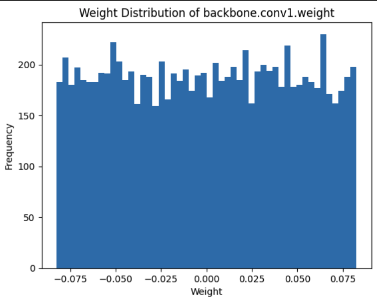
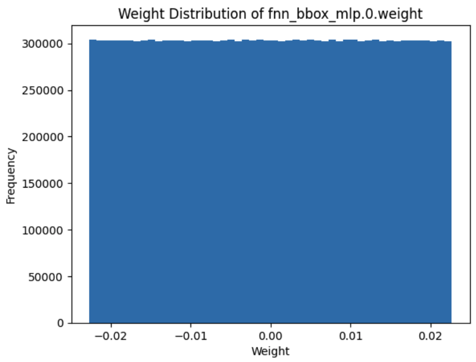

# DETR Model from Scratch
In an effort to better understand CNNs and Transformers, I am building the DETR model from scratch. This model has 141M parameters and can be trained on Google Colab. The code in the .py files will have far, far too many comments for any repo - and I like a lot of comments lol - but I made them mainly as my own note taking and references. 

If I had more money I would get some GPU compute and try to reproduce the DETR paper; however, this is a very expensive, data hungry architecture as it uses transformers. Nonetheless, we were still able to train from scratch and get reasonable results. With more compute, I'd be able to set up many more tests to tweak the hyper parameters. 

[GPU Poor Meme]

## Model Overview

1. CNN: The model starts with a CNN that outputs a series of channels representing features of size (H, W).
2. Positional Encodings: These features are combined with positional encodings and fed into the encoder.
3. Encoder: The encoder processes the features and passes them to the decoder.
4. Decoder: The decoder processes the input and passes it through a classifier layer to produce raw outputs.
5. Loss Function: The final outputs are processed with a softmax function, and a minimum loss algorithm is applied to match predictions with labels. The loss function used is the negative log likelihood (Cross-entropy).

## Python Script: detr_scratch.py:
There are three main Python scripts, each representing different levels of abstraction when training neural networks:

Implements the DETR model from scratch using minimal abstractions from the PyTorch API.
All matrix multiplications, linear/non-linear transformations, and CNN kernels are implemented using math and tensors.
This script is an exercise to build intuition about the underlying operations, which is crucial for understanding and debugging neural networks.

# Tuning Hyper parameters

  
  

## Results
The results compare the training performance of the three approaches on the same dataset. This comparison is not definitive but provides insights into the differences between fine-tuning and implementing a model from scratch.

[Results]

Feel free to explore the scripts and results to gain a deeper understanding of the DETR model and its implementation from scratch.