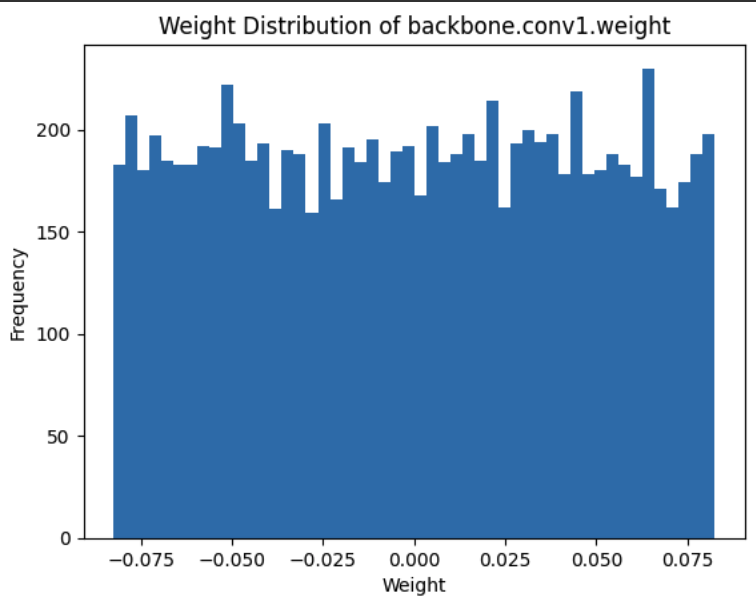
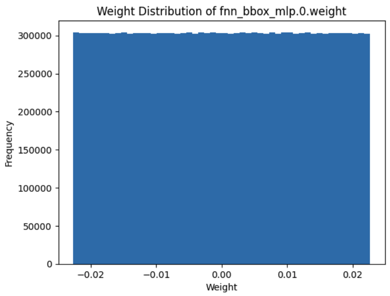

# DETR Model from Scratch: Table of Contents

1. [Introdiction](#introduction)
2. [Model Overview](#model-overview)
3. [Python Script Overview](#python-script)
4. [Tuning Hyperparameters](#tuning-hyper-parameters)
5. [Results](#results)
6. [Improvements](#improvements)

## Introduction
In an effort to better understand CNNs and Transformers, I am building the DETR model from 'scratch' (Note: The transformer is really the main thing built from scratch. The CNN, Linear and MLP layers were initialized using the PyTorch API). 

This model has 222M parameters - much more than the original DETR model with 141M parameters as to make the dimensions work I increased the number of self-attention heads from 8 to 11 and also implemented the backbone instead of importing the resnet-50 backbone like they did in the paper. The code in the .py files will have far, far too many comments for any repo - and I like a lot of comments lol - but I made them mainly as my own note taking and references. 

If I had more money I would get some GPU compute and try to reproduce the DETR paper; however, this is a very expensive, data hungry architecture as it uses transformers. Nonetheless, we were still able to train from scratch and get reasonable results. With more compute, I'd be able to set up many more tests to tweak the hyper parameters. 

[GPU Poor Meme]

## Model Overview

1. CNN: The model starts with a CNN that outputs a series of channels representing features of size (H, W).
2. Positional Encodings: These features are combined with positional encodings and fed into the encoder.
3. Encoder: The encoder processes the features and passes them to the decoder.
4. Decoder: The decoder processes the input and passes it through a classifier layer to produce raw outputs.
5. Loss Function: The final outputs are processed with a softmax function, and a minimum loss algorithm is applied to match predictions with labels. The loss function used is the negative log likelihood (Cross-entropy).

## Python Script:
Implements the DETR model from scratch using minimal abstractions from the PyTorch API.
All matrix multiplications, linear/non-linear transformations, and CNN kernels are implemented using math and tensors.
This script is an exercise to build intuition about the underlying operations, which is crucial for understanding and debugging neural networks.

## Training

### Understanding Residual Layers
<p align="center">
  
  
</p>

As you can see the from these two examples - see the v1 folder contains the weight distribution across more layers of the network - the distribution of weights at initialization are small and uniform landing between -0.02 and 0.02. The distribution is good for initial weights as they aren't too large that the first few training iterations are spent condensing the weights to an 'appropriate scale' and don't have a distribution far outside the appropriate mean of 0 and standard deviation of 1. 

Initializing very small, uniform weights can be extremely effective for training reliability in shallow neural networks; however, as the depth of the network grows it's extremely hard to fight against exploding or vanishing gradients. One trick is to add residual layers that add to the layer outputs. The reason this works so well is the gradient computed from the loss distributes evenly through addition (i.e the same gradient goes through the residual connection and deep learning layers). The code below shows how the outputs of each layer are added to x - and in the case of the decoder the initial output is added to randomly initialized object queries - to enable the gradient to 'flow' straight to the initial backbone:

```python
# Decoder block forward method
def forward(self, encoder_input, object_queries):
    x = object_queries + self.self_attention_decoder(object_queries, object_queries)
    x = self.layer_norm(x)
    x = x + self.self_attention_encoder(encoder_input, x)
    x = self.layer_norm(x)
    return x + self.feed_forward_layer(x)
```

```python
# Encoder block forward method
def forward(self, x):
    x = x + self.self_attention(x)
    x = x + self.feed_forward_layer(x)
    return self.layer_norm(x)
```

Therefore, the gradient doesn't vanish or explode as it's not reliant on any one neural network layer to properly process and distribute the gradient (i.e not one layer acts as the gate keeper to the initial gradient). Although we are using ReLu, which doesn't suffer from gradient vanishing or exploding as opposed to sigmoid and tanh, it's still good practice to dust off the ol' matplotlib code and see for yourself.

<p align="center">
  
</p>

So by initializaing the layer weights near 0, the gradient slowly 'turns these layers on' and adjusts the parameters of the model from the ground up as the gradient from the loss 'flows' straight to the first layer (i.e object queries and backbone). 

<p align="center">
  
  
  
  
</p>


### Initialization
The initialization of weights in the self-attention layers is a very important process. As you may have seen from the AttentionBase, EncoderBlock and DecoderBlock classes in my DETR model, I multiply my self-attention weights by `* self.head_size ** -0.5`. The reason we need to multiply the weights by `* head_size**-0.5` is that without it the variance in the outputs after the intial matmul is roughly on the scale of head_size - far different from the expected unit guassian distribution of mean=0 and std=1. Weights of the self-attention head need to conform to a unit gaussion distribution as they are passed into a softmax operation, which raises each value to an exponential. If the weights are not diffused at initialization, after the softmax operation the output essentially becomes one-hot vectors making training extremely difficult as you get exploding or diminishing gradients.

Here are some resources to investigate this further:
1. A very complicated research paper I don't understand: [Delving deep into rectifiers: Surpassing human-level performance on ImageNet classification](https://arxiv.org/pdf/1502.01852)
2. Pytorch's implementation of [kaiming or He initialization](https://pytorch.org/docs/stable/nn.init.html#:~:text=torch.nn.init.kaiming_normal_(tensor%2C%20a%3D0%2C%20mode%3D%27fan_in%27%2C%20nonlinearity%3D%27leaky_relu%27%2C%20generator%3DNone))


### Hyper Parameters
The ["End-to-End Object Detection with Transformers"](https://arxiv.org/abs/2005.12872) provides most of the hyper parameters used in the training of this neural network. For example, as illistrated in the paper,
1. The final dimensionality of the channel features (d_model_embed) is 256 - condense from 2048 by the 1x1 Conv Layer. 
2. The learning rate of the model is 1e-4.
3. The number of object queries - number of predictions the model can make - is hardcoded as 100 (N=100).


## Results
The DETR model takes a lot of compute to train effectively:

"Training the baseline model for 300 epochs on 16 V100 GPUs takes 3 days, with 4 images per GPU (hence a total batch size of 64)" 

Therefore, I was certainly not able to reach the same results as the paper; however, I was able to get some noticable improvements on loss and control the training stability reasonably well. The goal was to understand the structure of this model better, how the inner layers work, how to initialize weights and train transformers in a more calculated way. In addition, when I build future projects with computer vision I will have a much deeper, more intuitive understand of what's happening under the hood. 

<p align="center">
  
</p>

## Improvements 
1. More GPUs. 
2. Better initialization strategy. Based on what I have read, He initialization seems to be a good choice from deep networks utilizing ReLu as the non-linear function. 
3. Import the resnet-50 backbone. In the ["End-to-End Object Detection with Transformers"](https://arxiv.org/abs/2005.12872) research paper, they import the resnet-50 backbone instead of initializing backbone layers (i.e CNNs, Positional Encodings, etc) from scratch. 
4. This model takes a lot of compute, so as 
