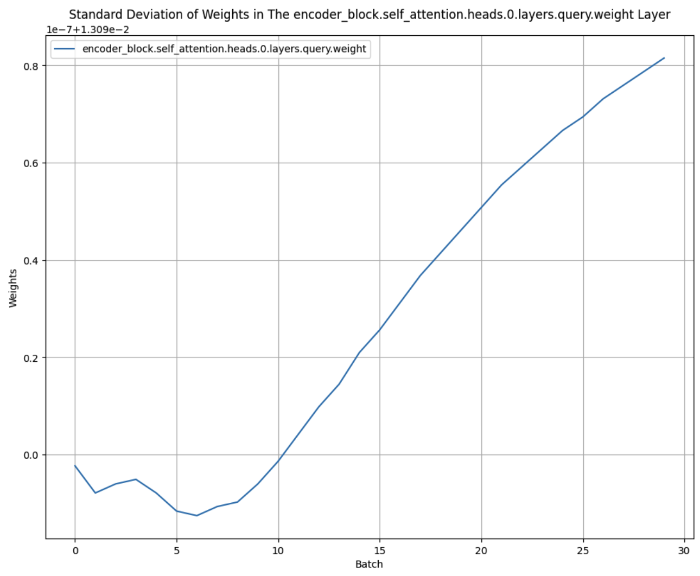

# DETR Model from Scratch: Table of Contents

1. [Introduction](#introduction)
2. [Model Overview](#model-overview)
4. [Training](#training)
5. [Results](#results)
6. [Improvements](#improvements)

## Introduction
I am building a DETR model to deepen my understanding of CNNs and Transformers - using the ["End-to-End Object Detection with Transformers"](https://arxiv.org/abs/2005.12872) research paper as a guide. The transformer is built from scratch, while the CNN, Linear, and MLP layers are initialized using the PyTorch API.

The model has 222M parameters, significantly more than the original DETR model with 141M parameters. This increase is due to the number of self-attention heads being increased from 8 to 11 and implementing the backbone with PyTorch instead of importing the ResNet-50 backbone.

The Python scripts are heavily commented, serving as my notes and references. Due to not having enough money for GPUs, I couldn't use the same amount of compute to reproduce the DETR paper. However, the goal of the exercise was to deepen my understanding of transformers/self-attention, computer vision, model initialization, and training stability.

## Model Overview

1. **CNN**: The model starts with a CNN that outputs image features of size (H, W).
2. **Positional Encodings**: The ouputs from the CNN model are combined with positional encodings and fed into the encoder.
3. **Encoder**: Processes the features with self-attention heads and passes them to the decoder.
4. **Decoder**: Combines the object queries and encoder output with a self-attention layer before passing it to a classifier to create the logits.
5. **Loss Function**: The logits are processed with a softmax layer, and two loss functions are used: negative log likelihood (cross-entropy) for classes and Hungarian loss for bounding box predictions.


## Training
### Understanding Residual Layers
As the network depth increases, it becomes harder to fight against exploding or vanishing gradients. Exploding gradients occur when the gradients become excessively large, leading to unstable backpropagation. Vanishing gradients occur when the gradients become too small, preventing effective training. To combat these issues, we use residual layers that add the outputs of each layer to the inputs of subsequent layers. 

In the case of the decoder, the initial output is combined with randomly initialized object queries (N=100) to facilitate gradient flow. Adding residual layers ensures that the gradients can backpropagate through the network without relying on any single layer to distribute them effectively. Below are the forward methods for the decoder and encoder blocks, illustrating how I implemented the residual connections:

```python
# Decoder block forward method
def forward(self, encoder_input, object_queries):
    x = object_queries + self.self_attention_decoder(object_queries, object_queries)
    x = self.layer_norm(x)
    x = x + self.self_attention_encoder(encoder_input, x)
    x = self.layer_norm(x)
    return x + self.feed_forward_layer(x)
```

```python
# Encoder block forward method
def forward(self, x):
    x = x + self.self_attention(x)
    x = x + self.feed_forward_layer(x)
    return self.layer_norm(x)
```

Although I am using ReLU as the non-linear function, which doesn't suffer from gradient vanishing or exploding as opposed to sigmoid and tanh, it's still good to dust off the ol' matplotlib skills and see the gradients for yourself.

<p align="center">
  
</p>


The charts below are a good illustration of why residual connections are so useful. As you can see in the top left chart, the backbone of the model is able to immediately start training as the gradient flows straight to it through the residual pathways. The self-attention layer - seen in the other three charts - takes more time to 'turn on' as their weights are initially quite small.

<p align="center">
  
  
  
  
</p>


### Initialization
The initialization of weights in the self-attention layers are particularly important. In the DETR model, weights are multiplied by ``* self.head_size ** -0.5`` to ensure they conform to a unit Gaussian distribution. This is necessary because the self-attention weights are passed into a softmax function, which raises each value to an exponential. If the weights are not properly initialized, the outputs after the softmax function can become one-hot vectors, making training difficult due to exploding or vanishing gradients. In addition, if the weights are too big or small the model spends the first few training cycles scaling or squeezing these weights into an appropriate distribution. 

(Note: If you are interested in seeing more charts depicting the initialization of weights in different layers, see the charts folder.)

<p align="center">
  
  
</p>

Here are some resources to investigate this further:
1. A very complicated research paper I don't understand: [Delving deep into rectifiers: Surpassing human-level performance on ImageNet classification](https://arxiv.org/pdf/1502.01852)
2. Pytorch's implementation of [kaiming or He initialization](https://pytorch.org/docs/stable/nn.init.html#:~:text=torch.nn.init.kaiming_normal_(tensor%2C%20a%3D0%2C%20mode%3D%27fan_in%27%2C%20nonlinearity%3D%27leaky_relu%27%2C%20generator%3DNone))


### Hyper Parameters
The hyperparameters are based on the ["End-to-End Object Detection with Transformers"](https://arxiv.org/abs/2005.12872) paper:
1. The final dimensionality of the channel features (``d_model_embed``) is 256 - downscaled from 2048 by the 1x1 Conv Layer. 
2. The learning rate of the model is 1e-4.
3. The number of object queries - number of predictions the model can make - is hardcoded as 100 (N=100).


## Results
The DETR model requires significantly more computational power than I currently have to train effectively:

"Training the baseline model for 300 epochs on 16 V100 GPUs takes 3 days, with 4 images per GPU (hence a total batch size of 64)" 

While I couldn't match the paper's results, I achieved reasonable improvements in loss and training stability. The goal was to understand the model's structure and how to initialize and train transformers effectively.

<p align="center">
  
</p>


## Improvements 
1. **More GPUs and training cycles**:
More computational power is needed to train the DETR model effectively. The original DETR paper mentions that training the baseline model for 300 epochs on 16 V100 GPUs takes 3 days. With more GPUs, I could run more extensive experiments, fine-tune hyperparameters, and reduce training time significantly.

2. **Importing the ResNet-50 Backbone**:
The original DETR model - ["End-to-End Object Detection with Transformers"](https://arxiv.org/abs/2005.12872) - uses a pre-trained ResNet-50 backbone to extract features from images. By importing and leveraging a pre-trained backbone, I can benefit from the rich feature representations learned from large-scale datasets. This would improve the model's performance and reduce the computational burden of training the backbone from scratch. Additionally, it would allow the DETR model to focus on learning the transformer-based object detection rather than spending resources on learning basic image features.

3. **Using more training cycles on testing and validation**:
Due to the fact that the model wasn't able to train for long enough to be effective, there was no point getting serious about model validation and testing. However, if you wanted to build a model that works reliably in production it would be extremely important to iterate on the design using more rigorous validation and testing. For now, this was merely a implementation exercise.
